## Handling certificate for users who are not in db
We will be having user's mail in certificate collection. When a new user is created, we will search the certificate collection by user.mail and add all certificate to users

## Auth
We will have a dedicated route in Express that would be for auth outside of GraphQL as a middleware

## Potential Operations on the Database

| Operation                                 | Type                          | Description                               |
| :--                                       | :--                           | :---                                      |
| User login                                | Read                          | Fetch from Firebase and Mongo             |
| User signup                               | Write                         | Write to Firebase and Mongo               |
| Batch of certificate                      | Write many                    | Write multiple docs to Mongo as batch     |  
| New certificate request                   | Write                         | Write to Mongo and storage(image and csv) |
| Download certificate by ID                | Read                          | Read by _id and fetch image to merge      |
| Verify certificate                        | Read                          | Read by _id and fetch image to merge      |
| Upload sign                               | Write                         | Write to Mongo and upload to images       |  
| Approve certificate                       | Write                         | Write to Mongo and add sign URI           |
| Reject certificate                        | Write                         | Write to Mongo                            |
| Fetch all certificate of mail             | Read                          | Read by filter from Mongo and fetch image |

